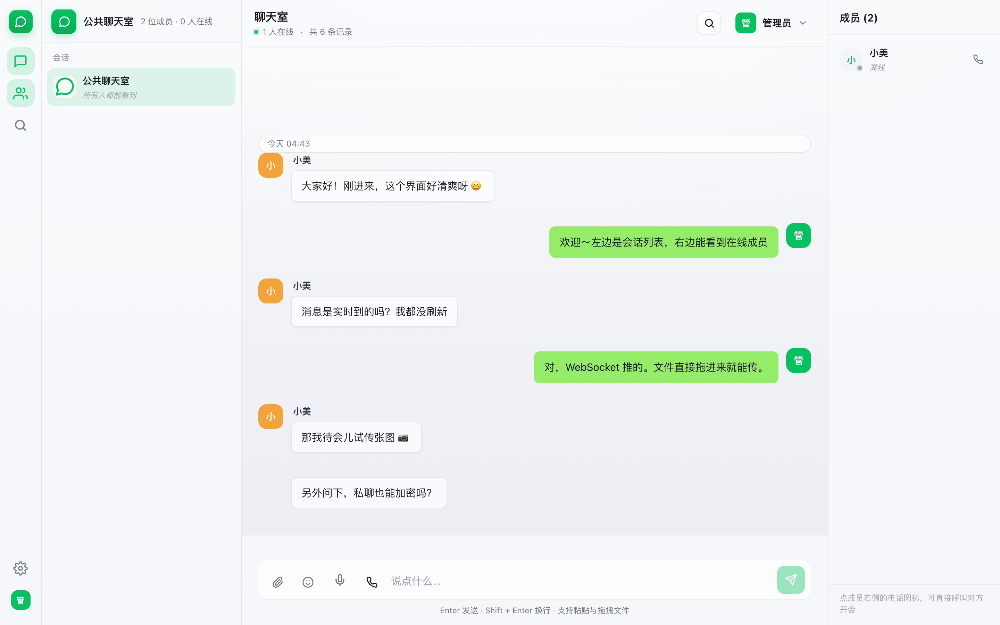
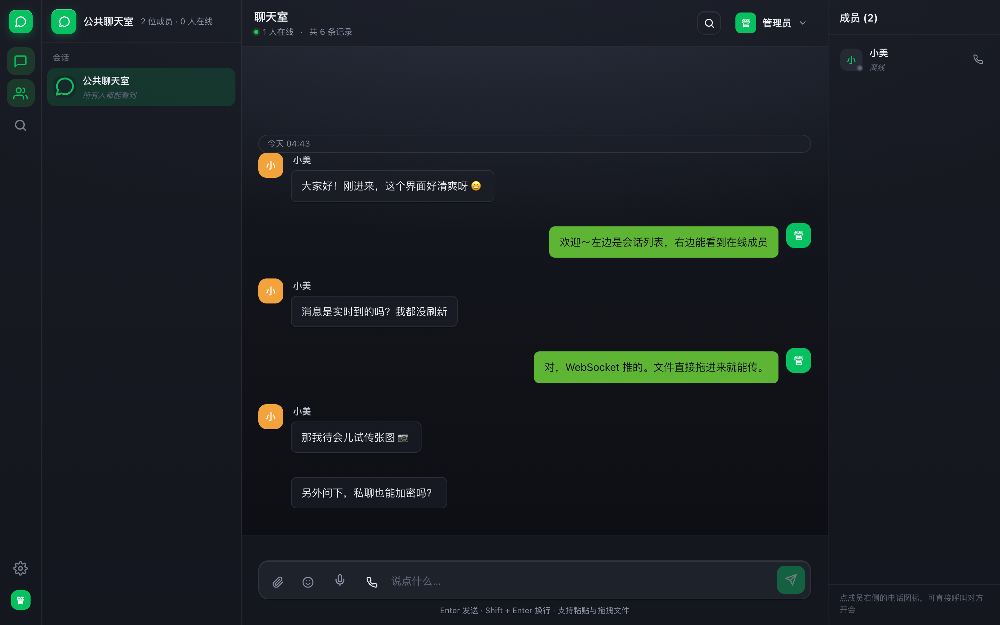
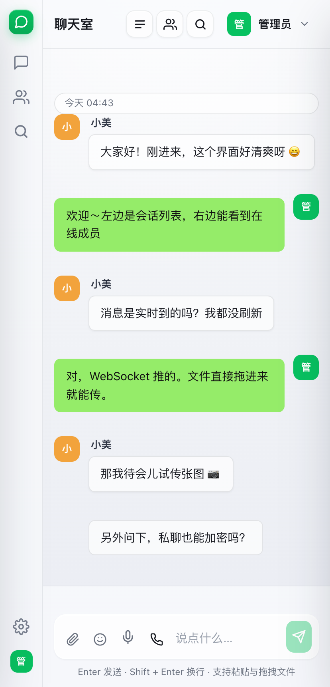
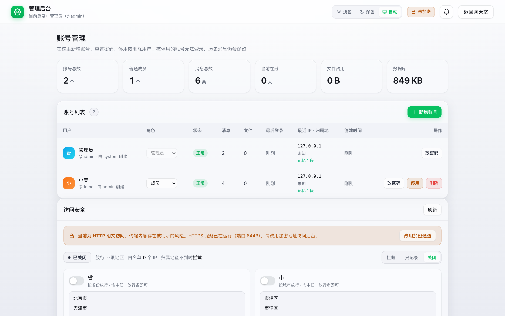

# Chat Server · 实时聊天室

一个功能完整、开箱即用的实时聊天室。基于 **Node.js + Express + Socket.IO + SQLite**，登录后才能使用，支持实时推送、历史检索、文件加密存储与后台账号管理。

> 项目自带 `install.sh` 一键安装脚本，任何主流 Linux 服务器（Ubuntu / Debian / CentOS / Rocky / Almalinux…）上 `sudo bash install.sh` 即可完成部署。
>
> **授权**：双许可模式，版权归 Lokeily 所有。
> - **个人 / 非商业使用**：适用 [AGPL-3.0](LICENSE)，自由使用、修改、分发；分发或对外提供服务时须公开修改后的源码。
> - **商业使用**：须**事先联系作者并取得书面授权**，否则不适用 AGPL 授权。详见 [COMMERCIAL.md](COMMERCIAL.md)。

## 界面预览

微信 PC 式多栏布局：左侧导航条 + 会话列表 + 聊天区 + 成员栏，Apple Liquid Glass 玻璃质感。

| 聊天主界面（浅色） | 深色主题 |
|:---:|:---:|
|  |  |

| 移动端 / 窄屏 | 管理后台 |
|:---:|:---:|
|  |  |

## 功能特性

| 功能 | 说明 |
|---|---|
| **桌面级界面** | 微信 PC 式多栏布局：左侧导航条 + 会话列表 + 聊天区 + 成员栏；Apple Liquid Glass 玻璃质感（磨砂、边缘高光、克制配色），支持浅色 / 深色 / 自动跟随系统 |
| 登录访问 | 未登录时右上角只有「登录」按钮，看不到任何消息；登录后才能进入聊天室 |
| 公共消息 | 所有账号共享同一个大厅，任何人发的消息所有人都能看到 |
| **实时推送** | 基于 WebSocket（Socket.IO），对方一发消息你立刻就能看到。**不轮询、不刷新**，服务端主动推 |
| **发送状态** | 消息先上屏再等确认（发送中 → 已送达）；失败会标红并提供「重新发送」 |
| **离线队列** | 断线期间发的消息不会丢，重连后自动补发 |
| **断线补齐** | 网络中断重连后，自动把掉线期间漏掉的消息补回来 |
| **未读提示** | 正在往上翻历史时来新消息，不打断阅读，改为浮出「N 条新消息」；标签页标题也带未读数 |
| 日期分隔 | 跨天才显示一次日期条（今天 / 昨天 / 具体日期） |
| 历史记录 | 登录后自动加载最近 40 条，向上滚动继续翻更早的；顶栏显示历史总条数 |
| 历史检索 | 顶栏放大镜可搜索全部历史（消息正文、文件名、发送人），关键词高亮，点击结果直接跳到原消息 |
| 在线人数 | 顶栏实时显示当前在线人数 |
| 文件上传 | 支持点击、拖拽、粘贴上传；服务端流式落盘，单文件上限默认 5MB（可用 `UPLOAD_MAX_MB` 调整），带上传进度；超限返回 413 |
| 图片/视频 | 图片直接显示缩略图，视频可直接播放，其他文件提供下载卡片 |
| 后台管理 | 管理员可新增账号、重置密码、停用/启用、删除账号，并查看统计 |
| **地域准入** | 后台「访问安全」提供**省、市两级独立开关**：想只放行某些省就开「省」开关选省份，想再卡城市就单独开「市」开关选城市，两级互不依赖、可单独生效；并支持查 IP 归属地、看访问日志、一键加白名单（默认关闭，开箱即用无限制，需要时自行开启） |
| **IP 归属展示** | 后台用户列表、访问日志自动显示每个 IP 的归属地（省/市）与运营商 |
| **登录封禁** | 连续输错 5 次自动封禁：1 分钟 → 5 分钟 → 10 分钟（一个循环），之后仍继续错误则永久封禁，需管理员解封 |
| **管理员豁免** | 管理员账号不受封禁限制，且首次访问免核验页；但**地域校验比普通用户更严**（放行省内 + 归属地与运营商都能识别才允许登录），权限最大所以卡得最紧 |
| **陌生 IP 放行** | 用户从新 IP 登录时挂起等待管理员审批；放行仅对本次登录有效，下次登录需重新审批 |
| **登录动态** | 后台「登录安全」实时显示每个账号的登录情况（IP、归属地、运营商、登录设备、结果、原因），管理员在线时收到实时推送；归属地查不到时标记「未知 · 有风险 · 刷新重试」 |
| **隐藏后台路径** | 管理后台入口为安装时自动生成的随机路径（或 `ADMIN_PATH` 指定），旧 `/admin` 与 `/admin.html` 一律返回 404，杜绝弱口令路径扫描 |
| **加密存储** | 消息正文、文件名、文件实体全部 AES-256-GCM 加密后落盘 |
| **加密传输** | 额外提供 HTTPS 端口（自签证书） |
| 数据持久化 | 用户、消息、文件全部保存在服务器本地（SQLite + 文件目录） |

## 实时性是怎么保证的

- **服务端广播**：任何人发消息，服务端立刻 `io.emit('chat:new', msg)` 推给所有在线连接。客户端不做定时轮询。
- **消息不丢**：发送时客户端生成一个 `clientToken`，本地先渲染「发送中」气泡；服务端确认并广播回来时按 token 对上号，替换为正式消息。断线时消息进入待发队列，重连后自动补发。
- **不会重复**：所有消息按服务端 id 去重，无论是走广播、走接口响应还是重连补齐，同一条只会渲染一次。
- **漏不掉**：客户端记住见过的最大消息 id，重连后调 `?after=<id>` 把中间缺的补齐。
- **日期条不重复**：渲染时按「跨天」判断，翻页边界会再做一次去重，避免出现两个「今天」。

## 快速开始（一键安装）

```bash
# 1. 克隆/上传项目到服务器
git clone https://github.com/Lokeily/chat-server.git
cd chat-server

# 2. 一键安装（自动装 Node.js 22 → 装依赖 → 生成后台路径 → 开机自启）
sudo bash install.sh
```

安装完成后，脚本会打印：

- **聊天室地址**：`http://<服务器IP>:8080`
- **管理后台地址**：`http://<服务器IP>:8080/<随机路径>`
- **初始管理员账号**：`data/INITIAL_ADMIN.txt`（仅首次启动生成）

> ⚠ 首次登录后**立刻**到后台修改初始管理员密码。

## Docker 部署

装有 Docker 的机器上一行启动：

```bash
docker compose up -d
```

数据（数据库 + 加密密钥 + 上传文件）持久化在 `./data`，删容器不丢数据。首次启动后查看初始管理员账号：

```bash
cat data/INITIAL_ADMIN.txt
```

改端口、后台路径、地域限制等配置，编辑 `docker-compose.yml` 的 `environment` 段后 `docker compose up -d` 重建即可。不用 Docker 的话，`Dockerfile` 也支持 `docker build -t chat-server . && docker run -d -p 8080:8080 -v "$PWD/data:/app/data" chat-server`。

## 手动部署

适用于已有 Node.js ≥ 22 的环境，或用 PM2 / Docker 管理进程的场景：

```bash
# 1. 安装依赖
npm install --omit=dev

# 2. 指定后台路径启动（不指定则每次启动随机生成）
ADMIN_PATH=/your-secret-admin node server.js

# 3. 用 PM2 守护（可选）
pm2 start server.js --name chat
pm2 save
pm2 startup   # 按提示执行输出的那行命令，实现开机自启
```

首次启动会自动创建管理员账号并打印在日志里：

```bash
cat data/INITIAL_ADMIN.txt
```

## 环境变量

| 环境变量 | 默认值 | 说明 |
|---|---|---|
| `PORT` | 8080 | HTTP 监听端口 |
| `HTTPS_PORT` | 8443 | HTTPS 监听端口（certs 目录存在证书时才启用） |
| `HOST` | 0.0.0.0 | 监听地址 |
| `ADMIN_PATH` | 随机生成 | 管理后台隐藏路径，如 `/my-secret-admin` |
| `ADMIN_PASSWORD` | 随机生成 | 首次启动时用它作为管理员密码 |
| `CHAT_SECRET` | 无 | 直接指定加密密钥（设置后优先于 `data/secret.key`） |
| `CHAT_DATA_DIR` | `./data` | 数据目录（多实例/测试用） |
| `BCRYPT_ROUNDS` | 12 | 密码哈希成本因子 |
| `SEARCH_SCAN_MAX` | 20000 | 历史检索最多扫描多少条 |
| `UPLOAD_MAX_MB` | 5 | 单文件上传上限（MB），超限返回 413 |
| `LINK_BANDWIDTH_MBPS` | 4 | 服务器出口带宽（Mbps），只用于前端估算下载耗时 |
| `GEO_GUARD` | `off` | 地域准入总开关：`off` 关闭 / `log` 只记录 / `on` 拦截 |
| `GEO_PROV_ON` | `0` | 省份开关：`1` 启用省级限制（仅放行 `GEO_PROVINCES` 内的省）；`GEO_GUARD=on` 时默认同时开启省级 |
| `GEO_CITY_ON` | `0` | 城市开关：`1` 启用市级限制（仅放行 `GEO_CITIES` 内的市）。与省级相互独立，可单独开启 |
| `GEO_PROVINCES` | 空 | 放行的省份，逗号分隔（如 `云南,贵州`），需 `GEO_PROV_ON=1` |
| `GEO_CITIES` | 空 | 放行的城市，逗号分隔（如 `昆明,南京`），需 `GEO_CITY_ON=1` |
| `GEO_FAIL_OPEN` | `0` | 归属地查不到时 `1` 放行 `0` 拦截（默认拦截，最高保密档） |
| `GEO_LOOKUP` | `1` | 是否启用 IP 归属地查询（`0` 关闭时不联网查询） |
| `GEO_ALLOW_IPS` | 空 | 逗号分隔的 IP 白名单，直接放行 |
| `GEO_API_BASE` | ip-api.com | IP 归属地查询接口地址（默认免 key，45 次/分钟） |
| `GEO_TIMEOUT_MS` | 2500 | 归属地查询超时（毫秒）。单次查询（主源+备用源）总时长另有 4 秒硬顶，超时按「查不到」处理 |

> 地域准入默认关闭（`GEO_GUARD=off`），开箱即用无限制；需要只允许某些地区访问时，在后台「访问安全」开启省/市开关并选好地区、配置白名单即可，改完立即生效。省与市是两级独立开关——例如只开「市=昆明」、不开「省」，那么只放行归属地为昆明的访客，其他省份一律拦截。区县级因免费 IP 归属地源不提供可靠区县数据，故不提供区级限制。

## 数据备份

```bash
# 停服备份（最稳）
systemctl stop chat
tar -czf chat-backup-$(date +%F).tar.gz data
systemctl start chat
```

恢复时把 `data/` 目录解回项目根目录即可。

**`data/secret.key` 必须一起备份。** 它是所有加密数据的钥匙，丢了之后数据库里的消息和 uploads 里的文件都会变成永远打不开的乱码 —— 没有后门，也没有找回的办法。

## 日常运维

```bash
systemctl status chat          # 查看运行状态
journalctl -u chat -n 50       # 查看日志（首次启动的管理员密码也在这里）
systemctl restart chat         # 重启
systemctl stop chat            # 停止

# 修改端口/后台路径后重启
# 编辑 /etc/systemd/system/chat.service 里的 EnvironmentFile 指向的 .env 文件，然后：
systemctl daemon-reload && systemctl restart chat

du -sh data/uploads            # 查看上传文件占用
df -h /                        # 查看磁盘剩余空间
```

## HTTPS

`certs/` 目录存在 `server.crt` + `server.key` 时，服务会自动额外开一个 HTTPS 端口（默认 8443）。自签证书能加密传输，但浏览器会告警。正式使用建议：

1. 准备一个域名，解析到服务器 IP；
2. 用 Let's Encrypt（如 certbot）签免费证书；
3. 把签好的 `fullchain.pem` / `privkey.pem` 覆盖到 `certs/server.crt` 和 `certs/server.key`，然后重启服务。

更省事的做法：用 Nginx/Caddy 做反向代理到 `127.0.0.1:8080`，由反向代理管证书和 443 端口。

## 安全说明

- **消息正文、文件名、文件实体全部加密**：AES-256-GCM，每条消息/每个文件独立随机 IV，密文以 `enc:v1:` 前缀标识。直接打开 `chat.db` 或用 `cat` 看上传目录，都只能看到乱码。
- **GCM 自带完整性校验**：密文被篡改后无法解密，服务端会降级显示为「内容无法解密」，而不是吐出错乱内容。
- **密码**：bcrypt 加盐哈希存储，成本因子 12。
- **会话**：令牌随机生成、存库、HttpOnly Cookie 传递（HTTPS 下附加 `Secure`），有效期 30 天。
- **登录封禁（账号级）**：连续输错 5 次触发，依次封禁 1 分钟 → 5 分钟 → 10 分钟（一个循环），之后仍继续错误则**永久封禁**，需管理员在后台「登录安全 → 封禁管理」解封。
- **陌生 IP 放行**：用户登录时若 IP 与上次不同（含首次登录），登录挂起等待管理员审批。管理员放行后，用户需**从该 IP 重新登录**才能进入；审批仅对本次有效。
- **IP 兜底限流**：单个 IP 一分钟内登录失败超 20 次触发临时限流（防无差别爆破，不影响正常用户）。
- **文件下载做了类型判断**：只有图片/视频/音频可在线预览，HTML、SVG 等一律强制下载并带 `nosniff`，防止上传挂马。
- **权限**：普通成员访问后台接口返回 403，未登录访问任何接口（包括历史与检索）返回 401。
- **安全响应头**：全站带 `X-Content-Type-Options`、`Referrer-Policy`、`X-Frame-Options`、`Permissions-Policy`、`Content-Security-Policy`，HTTPS 下附加 HSTS。
- **重置密码 / 停用 / 删除账号**时，会立即清除该用户的所有登录会话。
- **管理后台隐藏路径**：安装时自动生成随机路径（或 `ADMIN_PATH` 指定），前端「管理后台」入口通过服务端动态获取，旧 `/admin` 一律 404。

### 加密带来的两个代价（需要知道）

1. **历史检索不能在数据库里做**。正文是密文，SQL 的 `LIKE` 只能匹配到密文，所以检索是把最近 `SEARCH_SCAN_MAX`（默认 2 万）条取出来解密后在内存里过滤。数据量远超这个数时，更早的记录搜不到 —— 检索面板底部会明确写出「最近 N 条记录」。
2. **密钥必须备份**。见上文。

## 目录结构

```
.
├── server.js              服务端（Express + Socket.IO + SQLite）
├── install.sh             一键安装脚本
├── package.json           依赖清单
├── lib/
│   ├── crypto.js          加解密模块（AES-256-GCM）
│   ├── geo.js             IP 归属地查询
│   ├── access.js          文件可见性/引用校验
│   └── ratelimit.js       轻量速率限制
├── public/
│   ├── index.html         聊天室页面（含登录弹窗、历史检索）
│   ├── admin.html         管理后台页面
│   ├── regions.js         全国行政区划数据（省→市两级，供后台地区选择器使用）
│   ├── sounds/            提示音
│   └── vendor/            前端依赖（socket.io 客户端）
├── certs/                 HTTPS 证书（可选，首次部署自动生成）
└── data/                  运行时自动创建
    ├── chat.db            SQLite 数据库（用户 / 消息 / 文件索引）
    ├── secret.key         ★ 加密密钥（首次启动自动生成，权限 600）
    ├── uploads/           上传的文件实体（.enc 密文）
    └── INITIAL_ADMIN.txt  初始管理员账号密码（仅首次生成）
```

## 后续可选加固

1. 改掉初始管理员密码（登录后立刻在后台改）。
2. 定期备份 `data/` 目录，**连同 `secret.key`**。
3. 上传体积上限已内置（默认 5MB），如需调整设置 `UPLOAD_MAX_MB` 环境变量即可，无需改代码。
4. 若把服务暴露到公网，建议在防火墙里把来源 IP 限制为可信网段。
5. 进一步加强可考虑：启用 HTTPS（见上文「HTTPS」）、绑定域名隐藏真实 IP、关闭服务器上非必要端口。

## 技术栈

- **Node.js ≥ 22**（服务端使用内置 `node:sqlite` 与 `node:crypto`，不需要编译任何原生模块，加密也不依赖第三方库）
- Express 4 / Socket.IO 4 / Multer / bcryptjs
- SQLite（WAL 模式，数据本地落盘）

## License

本项目采用**双许可（Dual License）**，版权归 Lokeily 所有（Copyright (C) 2026 Lokeily）。

### 个人 / 非商业使用 —— [AGPL-3.0](LICENSE)

你可以免费用于个人学习、研究、自用部署，以及学校、公益、科研、政府等**非营利**场景，包括修改代码。

**但如果你把修改后的版本分发给别人，或部署成对外提供服务的站点（例如公开聊天室），你必须向使用者公开修改后的完整源代码。** 只在自己机器上运行、不分发也不对外服务的，没有任何额外义务。

### 商业使用 —— 须事先授权

**用于商业目的必须事先联系作者、取得本人同意并签署商业许可协议后方可使用。** 未取得书面授权的商业使用视为未获得许可，作者保留追究的权利。

商业使用包括但不限于：对外提供收费服务、集成进商业产品销售、企业内部营利性生产系统等。完整定义与洽谈方式见 **[COMMERCIAL.md](COMMERCIAL.md)**。

> 为什么不在 AGPL 原文上直接追加商用限制条款：AGPL-3.0 第 7 条不允许附加与其冲突的条款，而 AGPL 本身允许商用，因此「AGPL + 商用需授权」的叠加在法律上无效。采用双许可是实现这一诉求的通行且有效的方式。
